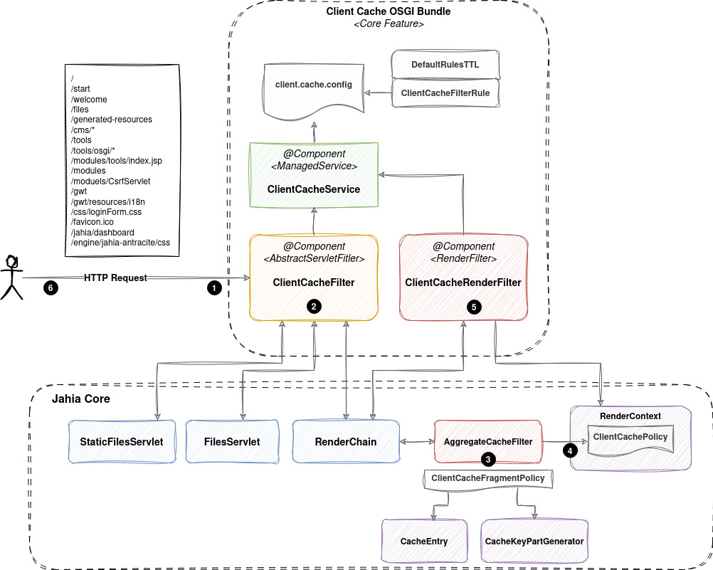

# Jahia Client Cache Control Bundle

### Overview

1. The HTTP request is received and intercepted by the ClientCacheFilter
    1. Depending on the configured ClientCacheFilterRule and the request URL some specific Cache-Control header is preset on the response
2. The request continues over a specific Servlet or to the RenderChain
    1. If a specific servlet takes the request, it can contribute a stricter `ClientCachePolicy` for its response as a request attribute (`ClientCachePolicy.contribute(request, policy)` in Jahia core), without writing the header. The FileServlet contributes a private policy for a file the guest user cannot read. The response wrapper applies the contributed policy before the response commits, only when it is stricter than the policy of the preset. In overrides mode only, a servlet can also write the header itself, as servlets did before this module existed.
    2. If the RenderChain is involved, when the RenderContext is created, a default 'public' ClientCachePolicy is populated in the RenderContext
3. For each fragment involved in the rendering :
    1. If the content is not already in cache, the AggregateCacheFilter call a method on each CacheKeyPartGenerator that is relevant for the fragment (those that don't have an empty value) to ensure is the existing part requires a 'private' level of caching. The result is a ClientCacheFragmentPolicy that is stored in the properties of the CacheEntry
    2. If the content is already in cache, the already calculated ClientCacheFragmentPolicy is retrieved from the CacheEntry properties, avoiding a call to each key part generator again.
4. For each fragment involved in the rendering, the AggregateCacheFilter enforce the ClientCacheFragmentPolicy on the RenderContext. If any encountered fragment policy is stricter than the already existing one, it is replaced
5. At the end of the rendering chain, the ClientCacheRenderFilter apply the RenderContext ClientCachePolicy to the response header using the values configured in the ClientCacheService.
6. An error response (`sendError`) or a temporary redirect (`sendRedirect`) gets the private template, whatever the preset, and its cache headers are final.
7. The Client get the response with a Cache-Control header that reflect specificity of the resource.
