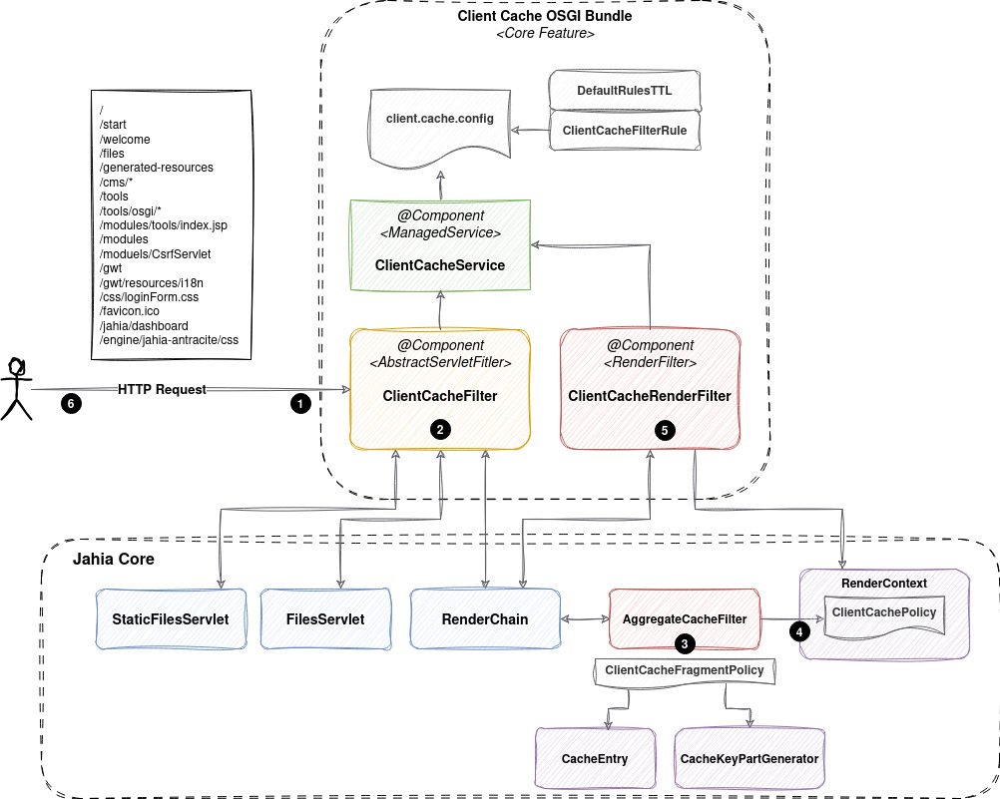

---
page:
  $path: /sites/academy/home/documentation/jahia/8_2/developer/rendering-pages-and-content/browser-caching-strategies
  jcr:title: Browser CDN caching strategies
  j:templateName: documentation
content:
  $subpath: document-area/text-3
---

:::info
Content in this page is applicable to environments running Jahia 8.2.3.0 or above.
:::


## Understanding cache http header management in Jahia

### Overview

The Jahia Client Cache Control module manages HTTP `Cache-Control` headers for all resources served by Jahia. It ensures that browsers, proxies, and CDNs receive cache directives consistent with the nature and content type of each resource.

The module works by:

1. **Intercepting HTTP requests** at the earliest stage (servlet filter level)
2. **Evaluating request URL patterns** against configured rules
3. **Applying appropriate Cache-Control headers** based on the resource type and caching strategy
4. **Fine-tuning cache policies** during page rendering (for dynamic content)
5. **Enforcing the final header** in the HTTP response

### Cache Control Strategies

The module defines five cache control strategies (templates), each with a specific use case:

#### Cache Strategies Comparison Table

| **Strategy** | **Browser Cache Duration**     | **CDN/Proxy Cache Duration** | **Jahia Content Type** | **Examples** | **Jahia Internal Resource** | **Best For** |
|---|--------------------------------|------------------------------|---|---|---|---|
| **Immutable** | 1 month | 1 month | Static Assets with versioned URLs | Generated resources, hashed JS/CSS files | Generated Resource Servlet | Content that never changes |
| **Public** | 1 second (check every request) | ~1 minute                    | HTML Pages (live mode) | Published pages, public content | RenderChain (page rendering) | Frequently updated public pages |
| **Public-Medium** | 1 second (check every request) | ~10 minutes                  | Static Files, Media, Modules | Media library files, module JS/CSS, downloadable documents | FileServlet, Repository Servlet | Static content, assets |
| **Custom** | 1 second (check every request) | Variable (component-based)   | Mixed Components | Pages with diverse content freshness needs | RenderChain (with component properties) | Complex pages with per-component TTL |
| **Private** | 0 seconds (never cache)        | 0 seconds (never cache)      | Personalized/Admin Content | User profiles, admin panels, sensitive data | RenderChain (private fragments) | User-specific or sensitive content |


#### 1. **Immutable** Strategy

**Default Header**: `public, max-age=##immutable.ttl##, s-maxage=##immutable.ttl##, stale-while-revalidate=15, immutable`  
**Default TTL**: 1 month (2,678,400 seconds)  
**Purpose**: For resources with unique, non-changing URLs

**Characteristics**:
- Clients cache forever (until cache expiration)
- CDNs/proxies cache forever  
- No revalidation required from the client
- Maximum performance optimization

**Used for**:
- Generated resources with unique filenames
- Static assets with versioned URLs
- Images, CSS, JavaScript with content hashes in filenames

---

#### 2. **Public-Medium** Strategy

**Default Header**: `public, must-revalidate, max-age=1, s-maxage=##medium.ttl##, stale-while-revalidate=15`  
**Default TTL**: 10 minutes (600 seconds)  
**Purpose**: For static content that changes infrequently

**Characteristics**:
- Browsers: check for updates on each request (max-age=1s)
- CDNs/proxies: cache for ~10 minutes
- Users may see stale content for up to 10 minutes after publication
- Balance between performance and content freshness

**Used for**:
- Static files (CSS, JavaScript without versioning)
- Images in media library
- Downloadable documents
- Module resources

---

#### 3. **Public** Strategy (Short-term)

**Default Header**: `public, must-revalidate, max-age=1, s-maxage=##short.ttl##, stale-while-revalidate=15`  
**Default TTL**: 1 minute (60 seconds)  
**Purpose**: For frequently updated public content

**Characteristics**:
- Browsers: check for updates on each request (max-age=1s)
- CDNs/proxies: cache for ~1 minute
- Users see updates within ~1 minute
- Good balance for most web content

**Used for**:
- HTML pages in live mode
- Dynamic content that changes regularly
- Pages without personal information

---

#### 4. **Custom** Strategy (user-defined term)

**Default Header**: `public, must-revalidate, max-age=1, s-maxage=%%jahiaClientCacheCustomTTL%%, stale-while-revalidate=15`  
**TTL**: reflect the internal Jahia cache TTL value set for the component (via `cache.expiration` property)  
**Purpose**: For dyanmic content with developper defined expiration times  

**Characteristics**:
- Browsers: check for updates on each request (max-age=1s)
- CDNs/proxies: cache duration set dynamically based on component properties
- Allows per-component cache duration configuration
- Uses Jahia's `cache.expiration` template property

**Used for**:
- Pages with mixed components having different expiration times
- Content with component-specific cache requirements

---

#### 5. **Private** Strategy (Most Restrictive)

**Default Header**: `private, no-cache, no-store, must-revalidate, proxy-revalidate, max-age=0`  
**Purpose**: For personalized, user-specific, or sensitive content

**Characteristics**:
- Browsers: no caching (max-age=0)
- CDNs/proxies: no caching
- No revalidation - must fetch fresh copy
- Most restrictive caching policy
- Each user gets personalized content

**Used for**:
- Admin pages
- User accounts and profiles
- Personalized content
- Pages with user-specific fragments
- All mutating operations (POST, DELETE, PATCH)

---

### How Cache Strategies are Applied

A predefined ruleset ensure that correct cache strategies are applied to Jahia content URLs. 
For common usage, there is no need to change the default ruleset as it covers all Jahia internal URLs with appropriate strategies.
The ruleset is defined in a YAML file and can be customized by modules.

#### Rule Matching Process

The module uses an **ordered priority system** to apply cache strategies:

1. **HTTP request arrives** at the web server
2. **ClientCacheFilter** (servlet filter) intercepts the request
3. **Rules are evaluated in priority order** (lower priority number = evaluated first)
4. **First matching rule is applied** based on:
   - HTTP method (GET, HEAD, POST, etc.)
   - Request URI (matched against regular expressions)
5. **Cache-Control header is set** using either:
   - A **template reference** (e.g., `template:public`)
   - A **literal header value** (e.g., `no-store,no-cache,must-revalidate`)

#### Default Rule Application

The default ruleset applies the following strategies:

| **Priority** | **HTTP Methods** | **URL Pattern** | **Strategy** | **Purpose** |
|---|---|---|---|---|
| 1 | GET, HEAD | `/cms/render/live/.*` | `public` | Published pages in live mode |
| 2 | GET, HEAD | `/cms/.*` | `private` | CMS administrative URLs |
| 3 | GET, HEAD | `/welcome.*` | `private` | Welcome page (requires authentication check) |
| 4 | GET, HEAD | `/start` | `private` | Start page |
| 5 | GET, HEAD | `/validateTicket` | `private` | Ticket validation |
| 6 | GET, HEAD | `/administration.*` | `private` | Administration pages |
| 7 | GET, HEAD | `/files/.*` | `public-medium` | Media library files |
| 8 | GET, HEAD | `/repository/.*` | `public-medium` | Repository assets |
| 9 | GET, HEAD | `/modules/.*` | `public-medium` | Module resources |
| 10 | GET, HEAD | `/engines/.*\.jsp` | `private` | JSP engines |
| 11 | GET, HEAD | `/tools(/.*)?` | `private` | Jahia tools |
| 12 | GET, HEAD | `/gwt/.*\.nocache\..*` | `private` | GWT non-cacheable resources |
| 13 | GET, HEAD | `/generated-resources/.*` | `immutable` | Generated resources (hashed URLs) |
| 14 | POST, DELETE, PATCH | `.*` | `private` | All mutations (state-changing operations) |
| 15 | GET, HEAD | `.*` | `public` | Fallback for all other content |

---

### Changing the configuration

**Global Client Cache Control configuration:**  
The configuration can be changed by using Jahia tools => OSGI console => configuration => org.jahia.bundles.cache.client
Thus you can change global configuration like the default TTL : short.ttl, medium.ttl or immutable.ttl

**Adding specific rules:**   
Any module can also provide specific ruleset by creating a file in `src/main/resources/META-INF/configurations/org.jahia.bundles.cache.client.ruleset-<modulename>.yml` with the same format as the default ruleset. The rules will be merged and sorted by priority with the default ruleset. 
Priority is a float number, the lower the priority number, the earlier the rule is evaluated. This allows you to insert rules at specific positions in the evaluation order without having to change the default ruleset (which is not recommended).

--- 

### Request Flow and Cache Header Application

```
HTTP Request
    ↓
[ClientCacheFilter - Servlet Filter]
    ├─ Wraps response to intercept header modifications
    ├─ Evaluates URL pattern against rules (in priority order)
    ├─ Pre-sets Cache-Control header based on matched rule
    └─ (STRICT mode: locks header from further modification)
    ↓
[Request Processing]
    ├─ Static Servlet Processing (files, assets)
    │  └─ Header pre-set by filter (may be locked in STRICT mode)
    ├─ RenderChain Processing (page rendering)
    │  ├─ Default "public" policy assigned to RenderContext
    │  ├─ Fragment evaluation with CacheKeyPartGenerator
    │  ├─ Fragment policies merged (may downgrade to "private")
    │  └─ ClientCacheRenderFilter applies final policy
    └─
[Response Headers Set]
    ├─ Filter pre-set header (may be overridden in ALLOW_OVERRIDES mode)
    ├─ Or final header from RenderChain processing
    └─
[Client/CDN Receives Response]
    └─ Cache-Control header dictates browser and CDN behavior
```

---

### Key Takeaways

- **Immutable**: Used for versioned static resources that never change
- **Public/Public-Medium**: Used for public, non-personalized content
- **Custom**: Used when different components on a page need different cache durations
- **Private**: Used for personalized or sensitive content
- **Browser vs CDN**: Browsers typically check on every request (max-age=1s), while CDNs cache longer (s-maxage=60_to_600s)
- **Jahia Pages**: Dynamic pages render through the RenderChain and may be downgraded from public to private if they contain user-specific content

---

## Understanding and Tweaking cache strategies to specific use cases

### Internal Architecture and Request Flow

This section explains how the Jahia Client Cache Control module works internally and how you can customize it for your specific needs.



#### Step 1: Initial Request Interception (ClientCacheFilter)

When an HTTP request arrives at Jahia:

1. **ClientCacheFilter** (a servlet filter) intercepts **all requests** (`pattern=/*`)
2. The filter wraps the response in a **ClientCacheResponseWrapper** to control header modifications
3. The filter looks up matching rules based on HTTP method and request URI
4. If a rule matches, a Cache-Control header is **pre-set** on the response

**Filter Behavior**:
- Operates in two modes:
  - **ALLOW_OVERRIDES mode** (default): Components can override the pre-set header
  - **STRICT mode**: Header is locked; any override attempt logs an error
- Preserves original request URI for debugging

#### Step 2: Request Processing

##### For Static Content (Servlets)

For static files, assets, and servlets:
- The pre-set header from ClientCacheFilter is used
- In STRICT mode, the header cannot be changed
- In ALLOW_OVERRIDES mode, servlets can override it if needed

##### For Dynamic Content (RenderChain - Page Rendering)

For HTML page rendering through Jahia's RenderChain:

1. **RenderContext Creation**:
   - A new RenderContext is created for the page request
   - A default **"public" ClientCachePolicy** is assigned
   - This represents the initial assumption that the page is cacheable publicly

2. **Fragment Rendering and Cache Key Analysis**:
   - As each fragment (content component) is rendered:
     - Jahia's **AggregateCacheFilter** evaluates the fragment
     - All **CacheKeyPartGenerators** registered for that fragment are called
     - Each generator can signal if the fragment is user-specific or personalized
   - This determines the **ClientCacheFragmentPolicy** for that fragment:
     - Public (default)
     - Private (if any generator indicates personalization)

3. **Fragment Policy Merging**:
   - Policies from all rendered fragments are merged into the global **RenderContext policy**
   - Rules: **If any fragment is private, the page becomes private**
   - Example: 
     - Header (public) + Navigation Menu (public) + User Profile (private) = **Page becomes private**

4. **Final Policy Application (ClientCacheRenderFilter)**:
   - At the end of the RenderChain, **ClientCacheRenderFilter** reads the final policy
   - It calls `ClientCacheService.getCacheControlHeader()` with:
     - The policy **level** (public, public-medium, custom, private)
     - Custom TTL parameter if needed
   - Sets a special **`Force-Cache-Control`** header that **overrides** the initial pre-set header
   - This ensures RenderChain policies take precedence

---

### The Role of ClientCachePolicyContributor and CacheKeyPartGenerators

**CacheKeyPartGenerators** are the key mechanism that determines how to cache a page fragment.
**CacheKeyPartGenerators** implement the **ClientCachePolicyContributor** interface that is able to influence the cache policy of a page 
fragment during rendering.

#### What is a ClientCachePolicyContributor?

A ClientCachePolicyContributor is a plugin that analyzes a fragment and returns a **ClientCachePolicy** according to the fragment content.  
By default, most of the fragments are considered public. However, if a fragment detects user-specific content or any information that may prevent the global page 
to be cached, it can return a private policy, which will downgrade the global page policy to private.

#### How They Work

1. During fragment rendering, Jahia invokes **all registered CacheKeyPartGenerators**
2. Each generator is called and the ClientCachePolicyContributor.getClientCachePolicy is evaluated to gather a ClientCachePolicy for that fragment
3. The policies from all generators are merged to determine the final policy for the page
4. If any generator returns a private policy, the entire page becomes private; otherwise it remains public
5. If the fragment contains a specific cache strategy (e.g., cache.properties with a specific TTL), it can also influence the final cache header applied to the page to propagate the specific ttl.

#### ClientCachePolicyContributor that requires a Private policy in Jahia

- **AclCacheKeyPartGenerator**: As the same fragment can be rendered with different content based on user permissions, it enforces a private policy
- **AjaxCacheKeyPartGenerator**: Most of the content retrieved by ajax is not cacheable as they are often user-specific or personalized, thus it enforces a private policy

All other default generators enforce a public cache policy.

#### Debugging: Which Generator Makes the Page Private?

To understand **why a page is private**, enable DEBUG logging for:

```
org.jahia.services.render.filter.cache.AggregateCacheFilter
```

**How to Enable Debug Logging** (via Jahia Tools):

1. Log in to Jahia as administrator
2. Go to **Tools > Configuration > Logging**
3. Add new loggers:
   - **Class/Package**: `org.jahia.services.render.filter.cache.AggregateCacheFilter`
   - **Level**: `DEBUG`
   - **Class/Package**: `org.jahia.bundles.cache.client.render.ClientCacheRenderFilter`
   - **Level**: `DEBUG`

**Log Output Example**:
```
DEBUG [AggregateCacheFilter] Determining client cache policy for fragment with key @@key@@
DEBUG [AggregateCacheFilter] Fragment with key @@key@@ requires 'private' client cache policy (cache.private)
(...)
DEBUG [AggregateCacheFilter] Determining client cache policy for fragment with key @@key@@
DEBUG [AggregateCacheFilter] Fragment with key @@key@@ requires 'public' client cache policy (computed)
```

---

### Configuration and Customization

#### Understanding the YAML Ruleset

The default ruleset is located in:
```
client-cache-control-bundle/src/main/resources/META-INF/configurations/
org.jahia.bundles.cache.client.ruleset-default.yml
```

**Ruleset Format**:

Each rule has **four segments** separated by semicolons (`;`):

```
priority;methods;urlRegex;headerSpec
```

**Example**:
```yaml
- "1;GET|HEAD;(?:/[^/]+)?/cms/render/live/.*;template:public"
   │       │                        │                   └─ Header specification
   │       │                        └─ URL regular expression
   │       └─ HTTP methods (pipe-separated)
   └─ Priority (float, lower = evaluated first)
```

**Header Specifications**:
- **Template reference**: `template:public`, `template:private`, `template:immutable`, etc.
- **Literal value**: `no-store,no-cache,must-revalidate` (raw Cache-Control header)

---

#### Custom Module Rules

To add cache rules for your module:

1. **Create a ruleset file** in your module at:
   ```
   src/main/resources/META-INF/configurations/
   org.jahia.bundles.cache.client.ruleset-<yourmodulename>.yml
   ```

2. **Define your rules** following the same format as the default ruleset

3. **Use appropriate priorities**:
   - Rules are merged with default rules and sorted by priority
   - Use floating-point priorities to insert rules at specific positions
   - Lower priority numbers are evaluated first

4. **Example: Immutable Assets**

   If your module contains Angular JS code with unique filenames:
   ```yaml
   name: "MyModule Ruleset"
   description: "Custom cache rules for MyModule"
   rules:
     - "8.99;GET|HEAD;(?:/[^/]+)?/modules/mymodule/js/uniquefilename.js;template:immutable"
   ```

   **Priority Placement**:
   - Default rule for `/modules/.*` has priority 9
   - Custom rule uses priority 8.99 (just before)
   - This ensures your rule is matched first

---

#### Custom TTL Configuration

You can customize the default TTL values for cache strategies:

1. **Via Jahia Tools**:
   - Go to **Tools > Configuration > OSGi Configuration**
   - Find PID: `org.jahia.bundles.cache.client`
   - Adjust:
     - `short_ttl` (default: 60 seconds)
     - `medium_ttl` (default: 600 seconds = 10 minutes)
     - `immutable_ttl` (default: 2,678,400 seconds = 1 month)

2. **Via Configuration Files**:
   - Create `org.jahia.bundles.cache.client.cfg` in Jahia's deployment directory
   - Set properties:
     ```properties
     short_ttl=60
     medium_ttl=600
     immutable_ttl=2678400
     ```

---

#### Custom Cache-Control Headers

You can customize the actual Cache-Control header values for each template:

1. **Via Jahia Tools**:
   - Go to **Tools > Configuration > OSGi Configuration**
   - Find PID: `org.jahia.bundles.cache.client`
   - Customize:
     - `cache_header_template_private`
     - `cache_header_template_public`
     - `cache_header_template_public_medium`
     - `cache_header_template_custom`
     - `cache_header_template_immutable`

2. **Placeholder Replacement**:
   - `##short.ttl##` → replaced with `short_ttl` value
   - `##medium.ttl##` → replaced with `medium_ttl` value
   - `##immutable.ttl##` → replaced with `immutable_ttl` value
   - `%%jahiaClientCacheCustomTTL%%` → replaced with custom TTL from component properties

**Example**:
```
public, must-revalidate, max-age=1, s-maxage=##short.ttl##, stale-while-revalidate=15, immutable
```

---

### Strict Mode vs Allow Overrides Mode

The module operates in two modes:

#### ALLOW_OVERRIDES Mode (Default)

- **Behavior**:
  - ClientCacheFilter pre-sets a header based on rules
  - Other components can override this header during request processing
  - In RenderChain, ClientCacheRenderFilter overrides with the final policy
  - Any override is logged at DEBUG level

- **Use Case**: Usage of modules that do not use the latest ruleset and that overrides cache headers directly (NOT RECOMMENDED)

- **Enable via Jahia Tools**:
  - Go to **Tools > Configuration > OSGi Configuration**
  - Find PID: `org.jahia.bundles.cache.client`
  - Set `mode` to `overrides`

---

#### STRICT Mode

- **Behavior**:
  - ClientCacheFilter pre-sets a header and **locks** the response
  - The header **cannot be modified** by any component
  - Any attempt to override the header logs an ERROR message
  - ClientCacheRenderFilter uses the special `Force-Cache-Control` header that can bypass this lock (RESERVED FOR RENDERCHAIN FINAL POLICY ONLY)

- **Use Case**: Well-known environments where you want to enforce strict cache policies and prevent any accidental overrides or dublin values

- **Enable via Jahia Tools**:
  - Go to **Tools > Configuration > OSGi Configuration**
  - Find PID: `org.jahia.bundles.cache.client`
  - Set `mode` to `strict`

---

### Common Customization Scenarios

#### Scenario 1: Your Module Has Unique Versioned Assets

**Problem**: You want `/modules/mymodule/js/uniquefilename.v123.js` to be cached forever (immutable).

**Solution**:

1. Create `src/main/resources/META-INF/configurations/org.jahia.bundles.cache.client.ruleset-mymodule.yml`:
   ```yaml
   name: "MyModule Assets"
   description: "Immutable js assets for MyModule"
   rules:
     - "8.42;GET|HEAD;(?:/[^/]+)?/modules/mymodule/js/.*\.v[0-9]+\.js;template:immutable"
   ```

2. These rules will be inserted before the default `/modules/.*` rule (priority 9)

---

#### Scenario 2: Your Module Has Personalized Content Pages

**Problem**: Your module includes specific CacheKeyPartGenerator to ensure that internal Jahia cache is aware of your specific content.

**Solution**:

1. Overrides the getClientCachePolicy method of the ClientCachePolicyContributor interface to return a private policy when the content is personalized
2. The cache policy will automatically become `PRIVATE` when personalized fragments are rendered
3. Verify with DEBUG logging on `ClientCachePolicyContributor`

---

### Monitoring and Troubleshooting

#### Enable Debug Logging

Enable DEBUG logging to see how the module processes requests:

1. **For ClientCacheFilter** (initial rule matching):
   - Logger: `org.jahia.bundles.cache.client.filter.ClientCacheFilter`
   - Shows rule matching and header pre-setting

2. **For ClientCacheRenderFilter** (final policy application):
   - Logger: `org.jahia.bundles.cache.client.render.ClientCacheRenderFilter`
   - Shows final policy and header application

3. **For Cache Policy Decisions** (which generator made it private):
   - Logger: `org.jahia.services.render.filter.cache.AggregateCacheFilter`
   - Shows which fragments are private and why

**How to Enable (via Jahia Tools)**:

1. Go to **Tools > Configuration > Logging**
2. Click "Add logger"
3. Enter the class name (e.g., `org.jahia.bundles.cache.client.filter.ClientCacheFilter`)
4. Set level to `DEBUG`
5. Save

---

### Reference Sample Modules

Jahia provides sample modules demonstrating common use cases:

1. **Cache Control Sample**:
   - URL: https://github.com/Jahia/OSGI-modules-samples/tree/main/cache-control-sample
   - Demonstrates: Custom rules, template usage, component-level TTL configuration

2. **Cache Key Part Generator Samples**:
   - URL: https://github.com/Jahia/OSGI-modules-samples/tree/main/cache-key-part-generator-samples
   - Demonstrates: Creating custom generators to detect personalization
   - Explains: How to make pages private based on custom logic

**Recommended**: Study these samples to understand advanced customization patterns.

---

### Key Architecture Components

| **Component** | **Purpose** | **File** |
|---|---|---|
| **ClientCacheFilter** | Servlet filter that pre-sets headers based on URL rules | `ClientCacheFilter.java` |
| **ClientCacheResponseWrapper** | Wraps response to control header modifications | `ClientCacheResponseWrapper.java` |
| **ClientCacheServiceImpl** | Core service managing rules, templates, and configuration | `ClientCacheServiceImpl.java` |
| **ClientCacheRenderFilter** | RenderChain filter that applies final policy from fragments | `ClientCacheRenderFilter.java` |
| **CacheKeyPartGenerator** | Jahia plugin detecting personalized fragments | Jahia core (`render-service`) |
| **ClientCachePolicyContributor** | Jahia core component merging fragment policies | Jahia core (`render-service`) |
| **AggregateCacheFilter** | Jahia's fragment cache filter invoking generators | Jahia core (`render-service`) |

---

### Best Practices

1. **Start from the default ruleset**: Don't modify the default rules unless absolutely necessary. Instead, add custom rules for your module.

2. **Use floating-point priorities**: When inserting custom rules, use floating-point priorities (e.g., 8.99, 8.501) to avoid collisions.

3. **Test with DEBUG logging**: Always enable DEBUG logging for `ClientCacheFilter` and `ClientCacheRenderFilter` during development.

4. **Understand your fragments**: Use DEBUG logging on `AggregateCacheFilter` to understand which fragments trigger private policies.

5. **Document custom rules**: Document why you added custom rules so future developers understand the intent.

6. **Use templates, not literals**: Prefer `template:public` over literal headers, so TTL changes apply automatically.

7. **Use immutable only when appropriate**: Only use the `immutable` template for resources with truly unique URLs.

---


